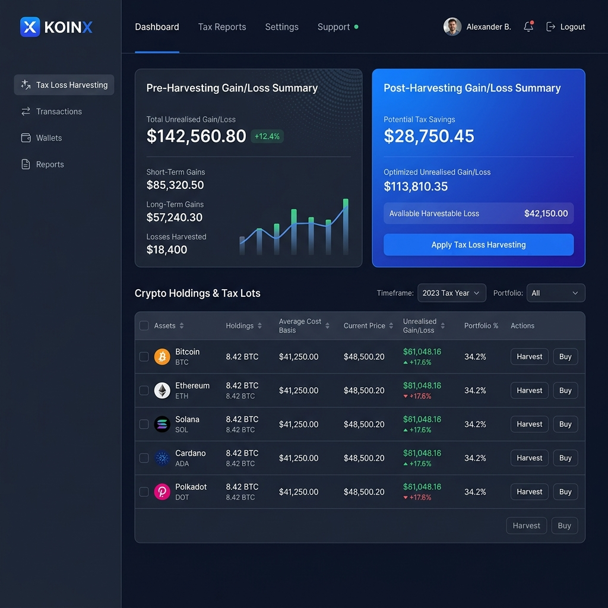

# 📈 KoinX — Crypto Tax Loss Harvesting Tool

[](https://koinx-tax-loss-harvesting.vercel.app)
[](https://reactjs.org/)
[](https://vitejs.dev/)
[](https://www.typescriptlang.org/)

A high-performance, responsive React-based interface designed for crypto investors to identify and execute **Tax Loss Harvesting** strategies. This tool helps users minimize their tax liability by strategically selling assets at a loss to offset capital gains.

---

## 🚀 Live Deployment
**URL:** [https://koinx-tax-loss-harvesting.vercel.app](https://koinx-tax-loss-harvesting.vercel.app)

---

## 📸 Interface Preview

*Modern, dark-themed dashboard with real-time gain/loss tracking and harvesting simulations.*

---

## ✨ Core Features

- **📊 Dynamic Gain Simulation**
  - **Pre-Harvesting View:** Real-time data from the Capital Gains API showing Short Term (STCG) and Long Term (LTCG) metrics.
  - **Post-Harvesting View:** Interactive simulation that updates as you select/deselect holdings for harvesting.
- **📉 Optimized Harvesting Logic**
  - Instant calculation of potential tax savings.
  - Smart categorization of losses (Short-term vs. Long-term).
- **📋 Advanced Holdings Table**
  - Bulk selection with "Select All" functionality.
  - Granular control over individual assets.
  - Responsive design that maintains readability on mobile.
- **⚡ Native Performance**
  - Powered by React 19 and Vite for near-instant load times.
  - Vanilla CSS for pixel-perfect control without the overhead of utility frameworks.

---

## 🛠 Project Architecture
The project follows a modular, feature-based directory structure for high maintainability:

```text
src/
├── components/          # UI Components (Header, Table, Cards, Loaders)
├── context/             # Global State Management (Harvesting Provider)
├── hooks/               # Custom hooks for API interaction & calculations
├── services/            # Mock API layer with simulated network latency
├── styles/              # Design tokens and component-specific CSS
├── types/               # Strict TypeScript interface definitions
└── utils/               # Numerical formatting and tax calculation helpers
```

---

## ⚙️ Setup & Installation

To run this project locally, follow these steps:

1. **Clone the repository**
   ```bash
   git clone https://github.com/Vegapunk-debug/koinX-tax-loss-harvesting.git
   cd koinX-tax-loss-harvesting
   ```

2. **Install Dependencies**
   ```bash
   npm install
   ```

3. **Launch local development server**
   ```bash
   npm run dev
   ```

4. **Build for Production**
   ```bash
   npm run build
   ```

---

## 📝 Key Assumptions & Rationale

- **Wash Sale Rules:** For the purpose of this interface, we assume the user understands wash-sale implications. The tool focuses on calculation rather than compliance auditing.
- **Mock Data Layer:** Data is fetched via a promise-based mock service to demonstrate asynchronous loading states and error handling (`ErrorState.tsx`).
- **Currency Handling:** The application defaults to **INR (₹)** as the primary currency, tailored for the target demographic.
- **State Flow:**
  ```diff
  - Simple Local State
  + Global Context Pattern
  ```
  We opted for `useContext` + `useReducer` to manage the complex interaction between the Holdings Table and the Summary Cards without unnecessary re-renders.

---

## 🧠 Business Logic Implementation

The core logic for tax savings is calculated as follows:

```typescript
// Simplified logic used in src/utils/calculations.ts
const calculateHarvesting = (holdings) => {
  const selectedHoldings = holdings.filter(h => h.selected);
  
  // Realised Gain = Net Gain after offsetting losses
  const postHarvestingGain = totalProfits - totalLosses;
  const savings = preHarvestingGain - postHarvestingGain;
  
  return savings > 0 ? savings : 0;
}
```

---

## 🤝 Contributing
Feel free to open an issue or submit a pull request if you have ideas for improving the harvesting algorithms or specialized UI enhancements!

---

*Built with ❤️ for the KoinX Engineering Challenge.*
